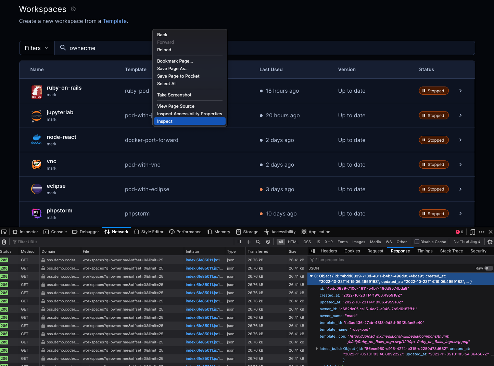

# API examples

At the present time, Coder does not have a published API, so I'm using this page to document common endpoint examples.

> Pro tip: While navigating the Coder Ui, use your browser's `inspect` to review
> API endpoint calls as move around UI pages. Click `network` and the `response`
> tabs to see structured JSON API responses.

You can also `grep` or control/command-F the [Go chi routes in the OSS repo](https://github.com/coder/coder/blob/main/coderd/coderd.go) to figure out API endpoints.





<details>
    <summary>Set environment variables to access url, apikey, etc.</summary>
<br/><br/>

```sh    
# your deployment's access url
export CODER_URL "http://your-access-url"
# your api key - get one at http://your-access-url/cli-auth
export CODER_SESSION_TOKEN="smh...F7t"
export API_ROUTE="api/v2"
# a workspace id
export WS_ID="4bd...da9"
# your org id (not a group, but the id for the entire deployment)
# you can retrieve your org id at http://your-access-url/api/v2/users/me
# hint hint: org IDs allow Coder to someday be multi-tenant...
export ORG_ID="a31...435"
```

> If you're a [fish](https://fishshell.com/) lover like me, you would use this
> format to set environment variables:
<br/>

```sh
set -x CODER_URL "http://your-access-url"
```

> The environment variables `CODER_URL` and `CODER_SESSION_TOKEN` can be also
> used with the `coder` CLI commands.

</details>

<details>
    <summary>Curl command formats</summary>
<br/><br/>
The shorter form
<br/><br/>

```sh    
curl "$CODER_URL/$API_ROUTE/workspaces" \
-H "Coder-Session-Token: $CODER_SESSION_TOKEN"
```

The longer form with the request type
<br/><br/>

```sh
curl --request GET \
--url "$CODER_URL/$API_ROUTE/users/me" \
--header "Coder-Session-Token: $CODER_SESSION_TOKEN"
```


</details>

<details>
    <summary>Get deployment info (e.g., environment variables)</summary>
<br/><br/>

To get environment variables set for your Coder deployment like enterprise paid features enabled, git authentication, wildcard access url, access url, coder bind address, etc.
<br/><br/>

```sh    
curl --request GET \
  --url "$CODER_URL/$API_ROUTE/config/deployment" \
--header "Coder-Session-Token: $CODER_SESSION_TOKEN"
```


</details>

<details>
    <summary>Info about apikey's user</summary>
<br/><br/>

This is helpful to retrieve the organization_id, needed for other API calls. This endpoint also shows the last time the user was active aka ```last_seen-at```. The user's roles are shown as well. e.g., `owner`, `template-admin`, etc.
<br/><br/>

```sh    
curl --request GET \
  --url "$CODER_URL/$API_ROUTE/users/me" \
--header "Coder-Session-Token: $CODER_SESSION_TOKEN"
```


</details>

<details>
    <summary>See the templates you have access to</summary>
<br/><br/>

Retrieve your organization id with the `/users/me` API call 

```sh    
curl --request GET \
  --url "$CODER_URL/$API_ROUTE/organizations/$ORG_ID/templates" \
--header "Coder-Session-Token: $CODER_SESSION_TOKEN"
```


</details>

<details>
    <summary>Retrieve template details e.g., active users, updated at, max time to live</summary>
<br/><br/>

To see details about a template, use the template id from the `organizations/<org-id>/templates` endpoint.

```sh    
curl --request GET \
  --url "$CODER_URL/$API_ROUTE/templates/$TEMPLATE_ID" \
--header "Coder-Session-Token: $CODER_SESSION_TOKEN"
```

</details>

<details>
    <summary>Latest template version detail including resources and startup_script details</summary>
<br/><br/>

To list the resources in a template, e.g., agents, `coder_app`, `kubernetes_pod`, metadata, and see the contents of the `startup_script`

```sh    
curl --request GET \
  --url "$CODER_URL/$API_ROUTE/templateversions/$TEMPLATE_VERSION_ID/resources" \
--header "Coder-Session-Token: $CODER_SESSION_TOKEN"
```

</details>

<details>
    <summary>Daily Active Users of a template</summary>
<br/><br/>

To see the last 20 days of DAUs for a template, use the template id from the `organizations/<org-id>/templates` endpoint.

```sh    
curl --request GET \
  --url "$CODER_URL/$API_ROUTE/templates/$TEMPLATE_ID/daus" \
--header "Coder-Session-Token: $CODER_SESSION_TOKEN"
```

</details>

<details>
    <summary>Groups with permissions to use and admin a template</summary>
<br/><br/>

To see which groups has permissions for a template, use the template id from the `organizations/<org-id>/templates` endpoint. This call also retrieves the users in the groups.

```sh    
curl --request GET \
  --url "$CODER_URL/$API_ROUTE/templates/$TEMPLATE_ID/acl" \
--header "Coder-Session-Token: $CODER_SESSION_TOKEN"
```

</details>

<details>
    <summary>Get your workspaces</summary>
<br/><br/>

To 

```sh    
curl --request GET \
  --url "$CODER_URL/$API_ROUTE/workspaces?\
q=owner:me" \
--header "Coder-Session-Token: $CODER_SESSION_TOKEN"
```

</details>

<details>
    <summary>Get a specific user's workspaces</summary>
<br/><br/>

To see the workspaces for a user. Note the query parameter is the username, not the user email.

```sh    
curl --request GET \
  --url "$CODER_URL/$API_ROUTE/workspaces?\
q=owner:$USER_NAME" \
--header "Coder-Session-Token: $CODER_SESSION_TOKEN"
```

</details>

<details>
    <summary>Get a count of a user's workspaces</summary>
<br/><br/>

To see the number of workspaces for a user. Note the query parameter is the username, not the user email.

```sh    
curl --request GET \
  --url "$CODER_URL/$API_ROUTE/workspaces/count?\
q=owner:$USER_NAME" \
--header "Coder-Session-Token: $CODER_SESSION_TOKEN"
```

</details>

<details>
    <summary>Details about a workspace</summary>
<br/><br/>

To see workspace details like its template, owner, and resources

```sh    
curl --request GET \
  --url "$CODER_URL/$API_ROUTE/workspaces/\
$WS_ID" \
--header "Coder-Session-Token: $CODER_SESSION_TOKEN"
```

</details>

<details>
    <summary>Show license entitlements</summary>
<br/><br/>

To see entitlements like high availability, template rbac aka groups, if a license is installed, is the experimental flag set, is it a trial?

```sh    
curl --request GET \
  --url "$CODER_URL/$API_ROUTE/entitlements\
" \
--header "Coder-Session-Token: $CODER_SESSION_TOKEN"
```

</details>

<details>
    <summary>Show active users</summary>
<br/><br/>

To show active users in your Coder deployment.

```sh    
curl --request GET \
  --url "$CODER_URL/$API_ROUTE/users\
?status:active" \
--header "Coder-Session-Token: $CODER_SESSION_TOKEN"
```

</details>

<details>
    <summary>Show groups in your Coder deployment</summary>
<br/><br/>

To see groups. The query returns the members of each group.

```sh    
curl --request GET \
  --url "$CODER_URL/$API_ROUTE/organizations/$ORG_ID/groups" \
--header "Coder-Session-Token: $CODER_SESSION_TOKEN"
```

</details>

<details>
    <summary>Show detail about a group</summary>
<br/><br/>

This includes the members and their roles.

```sh    
curl --request GET \
  --url "$CODER_URL/$API_ROUTE/groups/$GROUP_ID" \
--header "Coder-Session-Token: $CODER_SESSION_TOKEN"
```

</details>

<details>
    <summary>Last 5 events in the Audit Logs</summary>
<br/><br/>

Adjust `limit` to your liking.
Also see [ResourceTypes](https://pkg.go.dev/github.com/coder/coder@main/codersdk#ResourceType) and [Actions](https://pkg.go.dev/github.com/coder/coder@main/codersdk#AuditAction).

```sh    
curl --request GET \
  --url "$CODER_URL/$API_ROUTE/audit\
?limit=5" \
--header "Coder-Session-Token: $CODER_SESSION_TOKEN"
```

</details>

<details>
    <summary>Users Created Count</summary>
<br/><br/>

To 

```sh    
curl --request GET \
  --url "$CODER_URL/$API_ROUTE/audit/count\
?q=resource_type:user+\
action:create+" \
--header "Coder-Session-Token: $CODER_SESSION_TOKEN"
```

</details>

<details>
    <summary>Users created (limit 25)</summary>
<br/><br/>

To 

```sh    
curl --request GET \
  --url "$CODER_URL/$API_ROUTE/audit\
?limit=25&q=resource_type:user+\
action:create+" \
--header "Coder-Session-Token: $CODER_SESSION_TOKEN"
```

</details>

<details>
    <summary>Workspaces created</summary>
<br/><br/> 

```sh    
curl --request GET \
  --url "$CODER_URL/$API_ROUTE/audit\
?limit=5&q=resource_type:workspace+\
action:create+" \
--header "Coder-Session-Token: $CODER_SESSION_TOKEN"
```

</details>

<details>
    <summary>Templates created</summary>
<br/><br/>

```sh    
curl --request GET \
  --url "$CODER_URL/$API_ROUTE/audit\
?limit=5&q=resource_type:template+\
action:create+" \
--header "Coder-Session-Token: $CODER_SESSION_TOKEN"
```

</details>

<details>
    <summary>All actions by a specific email address</summary>
<br/><br/>

To 

```sh    
curl --request GET \
  --url "$CODER_URL/$API_ROUTE/audit\
?limit=1&q=email:$EMAIL+" \
--header "Coder-Session-Token: $CODER_SESSION_TOKEN"
```

</details>

<details>
    <summary>Empty</summary>
<br/><br/>

Use for next example 🍔 

```sh    

```

</details>


